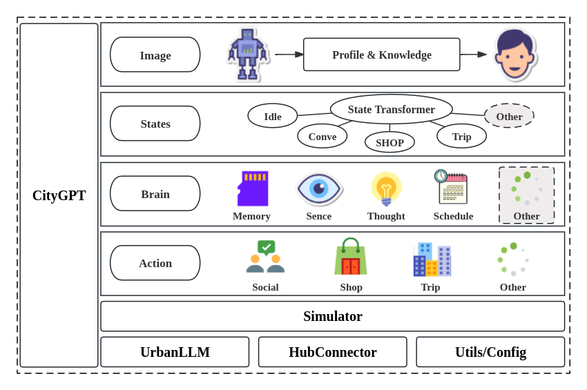

<div align="center">
  
  <h1>En-AgentSociety</h1>
  <p><strong>Observable and reproducible LLM-based urban simulation at regional scale</strong></p>
</div>

 &ensp;
[](https://gefgu.github.io/en-agentsociety/) &ensp;
[](https://en-agentsociety.readthedocs.io/en/latest/) &ensp;
[](https://gefgu.github.io/en-agentsociety/)

En-AgentSociety is an open-source urban simulation system for running,
inspecting, resuming, and validating LLM-driven generative-agent experiments.
It is designed for researchers who need more than plausible narratives: it
records the evidence needed to debug agent decisions, compare generated
mobility against empirical data, and reproduce long-running regional
simulations.

> **ACM SIGSPATIAL 2026 Demo.** En-AgentSociety has been accepted as a demo at
> the 34th ACM SIGSPATIAL International Conference on Advances in Geographic
> Information Systems. Visit the [project website](https://gefgu.github.io/en-agentsociety/)
> for the demo overview, paper, and installation instructions.

The project builds on the original
[AgentSociety](https://github.com/tsinghua-fib-lab/agentsociety) framework, but
centers its own extensions around observability, fault tolerance, empirical
mobility validation, and scalable regional workflows.

## What En-AgentSociety Adds

- **Full simulation observability**: logs prompts, responses, agent states,
  memories, emotions, visited places, semantic POI categories, generated
  trajectories, block execution times, LLM latency, and token usage.
- **Reproducible fault-tolerant runs**: persists checkpoints for agent memory,
  messages, mobility state, and simulator state so interrupted experiments can
  resume from a safe step.
- **Validation-ready mobility traces**: exports generated trajectories and
  semantic visits to mobility-metric pipelines for comparison against empirical
  datasets, mobility laws, motifs, OD matrices, and activity distributions.
- **Flexible storage**: supports Dockerized ClickHouse for large experiments and
  DuckDB for local, serverless execution and testing.
- **Typed prompt and response layer**: uses Pydantic prompt classes and output
  schemas to validate LLM responses, trigger retries, and make prompts easier
  to maintain.
- **LLM optimization tools**: includes Qdrant-backed semantic caching, batched
  embeddings, detailed cache metrics, and routing support for multiple LLM
  providers.
- **Regional simulation workflows**: supports CitySim-style behavioral modules,
  traffic-simulation integration, and scalable regional map-generation work.
- **Interactive debugging UI**: exposes agent timelines, module-level execution,
  prompt-response traces, and mobility analytics through the web interface.

<div align="center">
  
</div>

## Installation

En-AgentSociety requires Python 3.11 or newer.

```bash
pip install en-agentsociety
```

Optional local mobility-analysis dependencies can be installed with:

```bash
pip install "en-agentsociety[mobility]"
```

## Quick Start

Create a YAML configuration with LLM, environment, map, agent, and experiment
settings. A minimal template is available in
[`examples/config_templates/example_config.yaml`](../../examples/config_templates/example_config.yaml).

Check the configuration:

```bash
en-agentsociety check -c ./config.yaml
```

Run a simulation:

```bash
en-agentsociety run -c ./config.yaml
```

Launch the web UI:

```bash
en-agentsociety ui
```

The repository includes examples for hurricane impact, polarization,
inflammatory-message interventions, prospect-theory experiments, UBI scenarios,
and rumor spreading in [`examples/`](../../examples).

## Documentation

- Project website and demo: <https://gefgu.github.io/en-agentsociety/>
- Online documentation: <https://en-agentsociety.readthedocs.io/en/latest/>
- Local docs source: [`docs/`](../../docs)
- Package source: [`packages/en-agentsociety/`](.)
- End-to-end and unit tests: [`packages/en-agentsociety/tests/`](./tests)

## Relationship to AgentSociety

En-AgentSociety is derived from the original AgentSociety project by FIB Lab,
Tsinghua University. AgentSociety introduced the base LLM-driven urban
simulation framework; En-AgentSociety extends that foundation with the
observability, checkpointing, validation, caching, database, and UI capabilities
needed for reproducible regional-scale mobility research.

Original AgentSociety paper:

```bibtex
@article{piao2025agentsociety,
  title = {AgentSociety: Large-Scale Simulation of LLM-Driven Generative Agents Advances Understanding of Human Behaviors and Society},
  author = {Piao, Jinghua and Yan, Yuwei and Zhang, Jun and Li, Nian and Yan, Junbo and Lan, Xiaochong and Lu, Zhihong and Zheng, Zhiheng and Wang, Jing Yi and Zhou, Di and others},
  journal = {arXiv preprint arXiv:2502.08691},
  year = {2025}
}
```

## Citation

If you use En-AgentSociety, please cite the ACM SIGSPATIAL 2026 demo paper:

```bibtex
@inproceedings{santos2026enagentsociety,
  title = {En-AgentSociety: Observable and Reproducible LLM-Based Urban Simulation at Regional Scale},
  author = {Santos, Gustavo H. and Viana, Aline Carneiro and Silva, Thiago H.},
  booktitle = {Proceedings of the 34th ACM SIGSPATIAL International Conference on Advances in Geographic Information Systems},
  year = {2026},
  note = {Demo paper}
}
```

The [demo paper PDF](../../En-AgentSociety.pdf) is included in this repository.

## License

En-AgentSociety is licensed under the Apache License Version 2.0, except for
the `packages/en-agentsociety/commercial` folder. See
[`LICENSE`](../../LICENSE) for details.
